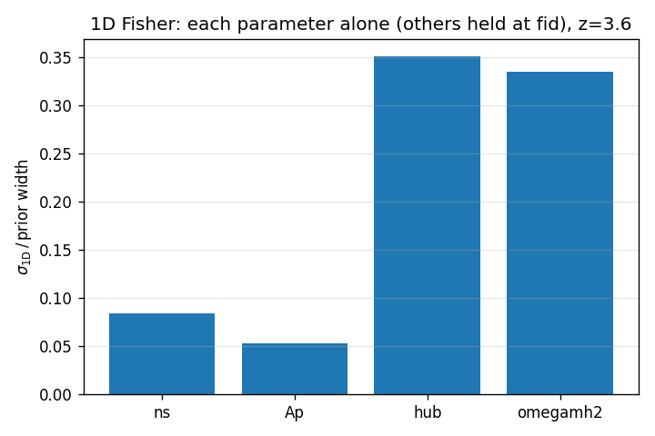
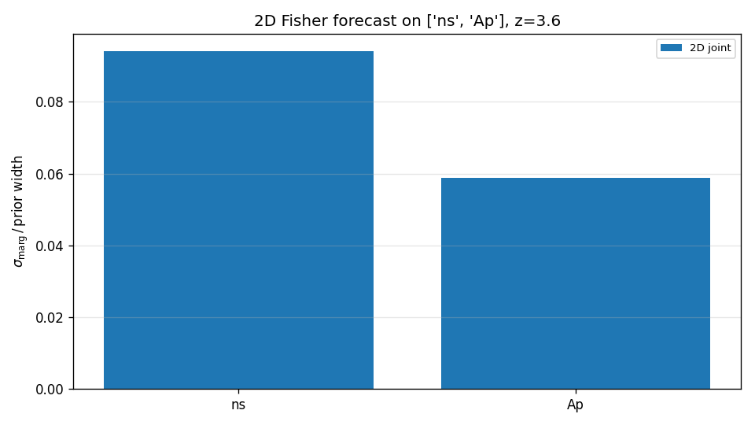
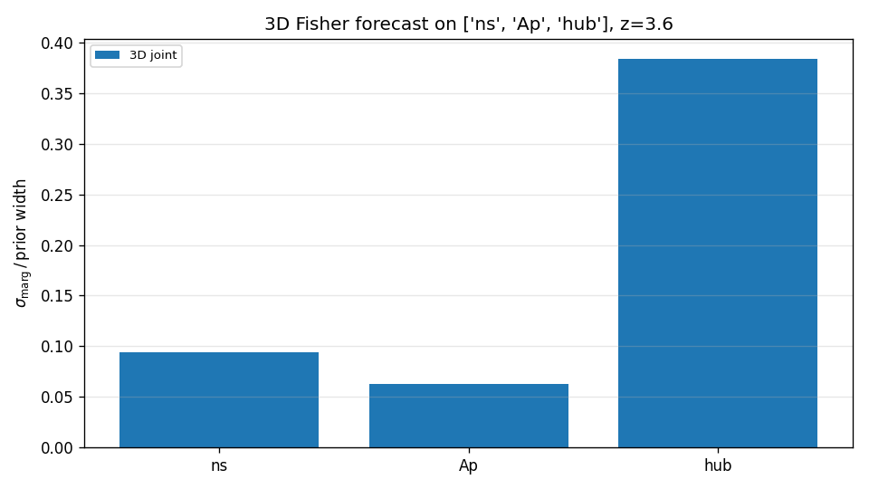
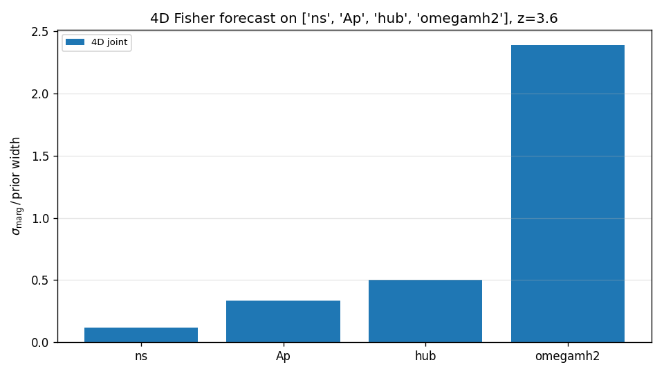
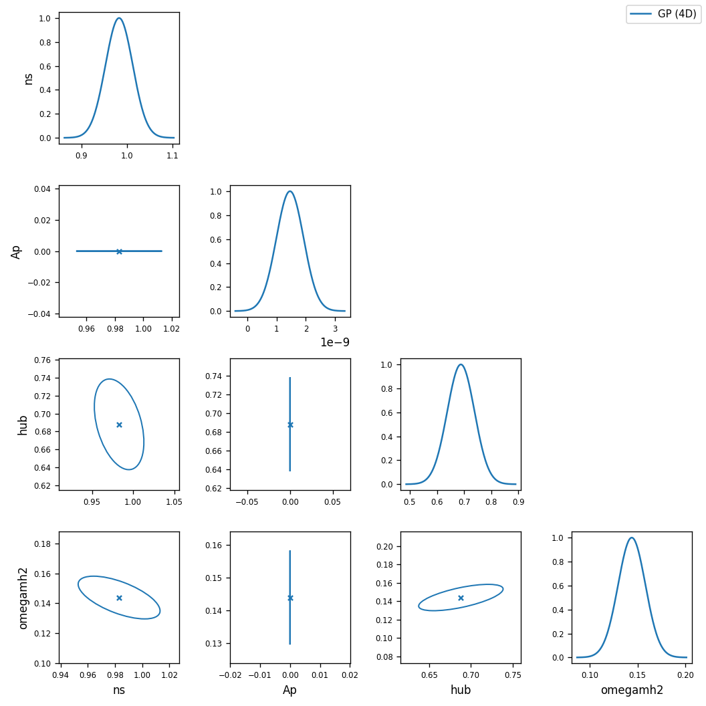

# Figures: what they show and what to check

Every forecast run produces these figures under its output directory. The
sample set under `docs/figures/` is regenerated by

    PYTHONPATH=/home/mfho/student_projects/lya_emulator_full:src \
        python scripts/regen_sample_figures.py

against the **real** PRIYA GP at fiducial + the eBOSS DR14 covariance.

Each figure below has a "diagnostic checklist" — what should be true if
the framework is working, and what's a red flag.

---

## fig01 — GP prediction at fiducial vs eBOSS DR14

**What it shows**: GP-emulated `P_F(k)` at the fiducial parameter values,
overlaid on the eBOSS DR14 measurement at `z=3.6` with ±σ error bars.

**Why it matters**: This is the single most important sanity check. The
forecast assumes the GP is the truth. If the GP isn't already a decent
fit to the data at fiducial, every forecast number downstream is
suspect. The student's PRIYA paper has already shown this fit works at
sub-percent level after MCMC; we just need to verify our pipeline is
loading the right z-bin, the right cov, and the right basedir.

**Checklist**:
- [ ] GP line tracks data points within ±σ across the entire k range.
- [ ] No discontinuities or sudden jumps in the GP curve.
- [ ] eBOSS error bars grow at low k (cosmic variance) — that's expected.

---

## fig02 — Per-parameter sensitivity

**What it shows**: For each of the 11 PRIYA parameters,
`d ln P_F / dθ̂_i` where `θ̂_i = θ_i / prior_width_i`. Curves with large
absolute values mean the data strongly responds to that parameter; flat-
near-zero curves mean the parameter is essentially invisible at this z.

**Why it matters**: Tells you which parameters are *worth* fitting PySR
equations for. Parameters with sensitivity ≪ 0.05 across the k-range
won't be constrained at any reasonable budget — don't bother training
PySR equations for them at one redshift, you need multi-z combination
to break the degeneracy.

**Sample reading**:
- `tau0` is dominant (~0.6) — mean flux is the largest single effect.
- `Ap` is second (~0.25) and constant in k — pure amplitude.
- `ns` flips sign through k≈0.005 — that's the spectral pivot.
- `dtau0/herei/heref/alphaq/hireionz/bhfeedback` cluster near zero.

**Checklist**:
- [ ] tau0 / Ap / ns visibly separate from the noise floor.
- [ ] At least one of (hub, omegamh2) shows non-trivial k-dependence.
- [ ] No spurious oscillations (a sign that the stencil step is too
      small and you're hitting numerical noise).

---

## fig03 — 1D Fisher (one parameter at a time)

**What it shows**: For each of (ns, Ap, hub, omegamh2), the 1D Fisher σ
in units of prior width — i.e. *if everything else were perfectly
known*, how well would the eBOSS-z=3.6 data alone constrain this
parameter?

**Why it matters**: Lower bound on the achievable error. A parameter
with σ_1D / width = 0.05 is a 5%-of-prior measurement under perfect
external knowledge; in 4D joint, it'll only get worse.

**Sample reading**:
- ns: ~8% of prior width — well-constrained.
- Ap: ~5% of prior width — best-constrained of the four.
- hub, omegamh2: ~33-35% — already weakly constrained at 1D.

**Checklist**:
- [ ] Bars are positive and finite (NaN/inf means F_ii=0 — your
      gradient is zero somewhere).
- [ ] Bars are below 1.0 (otherwise the parameter is unconstrained
      even with everything else fixed).

---

## fig04 / fig05 / fig06 — 2D / 3D / 4D Fisher

**What they show**: σ_marg on each parameter when all parameters in the
named subspace float jointly (the others are still pinned to fid). Each
new dimension opens a new degeneracy that can only inflate σ.

**Why it matters**: The growth of σ between 1D and 4D is the cost of
degeneracy. If σ_4D / σ_1D ≈ 1, the parameter is approximately
independent of the others; if σ_4D / σ_1D ≫ 1, you're fighting a strong
correlation.

**Sample reading**:
- ns: 0.084 (1D) → 0.114 (4D) — minor inflation.
- Ap: 0.052 → 0.327 — moderate.
- hub: 0.350 → 0.499 — already near-prior-saturated.
- omegamh2: 0.335 → 2.40 — **the prior is no longer informative**;
  this parameter is degenerate with one of (Ap, hub) at z=3.6.

**Checklist**:
- [ ] Each bar in fig06 ≥ the corresponding bar in fig03 (degeneracies
      can only hurt, never help).
- [ ] At least one bar in fig06 ≫ 1 → that parameter needs multi-z
      data to break the degeneracy. That's a real result for the paper,
      not a bug.

---

## fig07 — 4D Fisher-Gaussian corner

**What it shows**: 1D marginalized Gaussian posteriors on the diagonal;
1σ confidence ellipses off-diagonal. Each ellipse's tilt = the
parameter-pair correlation; the elongation = how degenerate.

**Why it matters**: Identifies *which* degeneracies are doing the
damage in fig06. If hub-omegamh2 ellipse is highly elongated and aligned
along a tilted axis, those two parameters are degenerate and you need
external data (Planck CMB, BAO) or multi-z Lya to break it.

**Sample reading**:
- ns row: tight blob — ns is well-constrained and weakly correlated
  with everything.
- Ap appears as a horizontal line in panels with other params
  because Ap's σ is ~10⁻⁹ (tight on its own), and the auto-zoom on
  larger-σ neighbors makes it look squashed. **This is a plot-axis
  artifact, not a real flatness.**
- hub-omegamh2: visibly elongated ellipse → that's the degeneracy
  inflating omegamh2 in fig06.

**Checklist**:
- [ ] Diagonal marginals have a clear single peak (not bimodal).
- [ ] No NaN-axis panels (means F was singular).
- [ ] Tilted ellipses correspond to known physics (e.g., σ_8 - h
      degeneracy in cosmology).

---

## What to add when you have a PySR equation set

Add `--eqn configs/eqns/my_pysr.yaml` to the run; the same figures will
be regenerated with **both** GP and PySR overlaid. Check:

- **fig01**: PySR and GP fiducial lines should overlap to within
  ±σ_eBOSS. Otherwise the equations aren't reproducing fid.
- **fig02**: PySR sensitivity should track GP sensitivity for parameters
  the equations actually depend on.
- **fig06**: PySR σ ≈ GP σ → the equations preserve the constraining
  power of the emulator. PySR σ ≫ GP σ → the equations are losing
  information; tighten the Pareto pick (use `accuracy_at:` with a
  smaller tolerance).
- **fig07**: PySR ellipses should overlap GP ellipses. Sharply
  different tilts → the PySR set is inducing a fake correlation, often
  because one parameter's equation is contaminating another's.

---

## The reward-loop comparison set (`docs/figures/compare_loop/`)

Whenever you run `compare_equation_sets()` (or
`scripts/regen_sample_figures.py` ships a sample), you get a directory
with these per-comparison artefacts:

### `eq_card_<set_name>.png` — equation card

A LaTeX-rendered listing of every equation in the set, with:
- The equation set's name, redshift, and combine recipe (rendered).
- Each per-parameter equation as `f_i(θ_i, k) = …`.
- Below each, the Pareto-pick metadata: complexity, loss, fiducial.

Use this to audit "what equations am I forecasting on?" at a glance.
If a particular parameter's equation looks too simple (constant, or
linear with tiny coefficient), that's why its 1σ blew up in
`forecast_sigma.png`.

### `forecast_sigma.png` — bar comparison

Log-y bar chart, one bar per (parameter, equation set) combination.
The GP is the reference; bars taller than GP mean that equation set is
losing information.

Sample reading from the shipped figures:
- `GP` and `perfect_1D_slices` bars are bit-for-bit identical → the
  comparison plumbing is correct (a perfect 1D-trained PySR set with
  multiplicative combine reproduces the GP Fisher exactly).
- `taylor_quadratic` is 2-3 orders of magnitude worse → that's what an
  under-trained equation set costs.

### `forecast_corner.png` — Fisher corner overlay

All equation sets overlaid; axes scaled to the *tightest* result so
the reference contours are always visible. If a PySR set's ellipse
runs off the panel as a straight line (as `taylor_quadratic` does in
the sample), the equations are too loose to constrain that subspace
at all — go retrain.

### `residual_<set_name>.png` — fiducial residual

`(P_PySR(θ_fid) - P_GP(θ_fid)) / σ_eBOSS` per k bin. If this is bigger
than ±1 anywhere, the equations don't even reproduce fid; everything
downstream is suspect.

### `summary.md` — scoreboard markdown

Plain markdown table of σ per parameter and σ_pysr/σ_gp ratio per
equation set. Drop into a slide or paper summary as-is.

### Iterating

This is your **reward loop**: each time you retrain PySR with new
hyperparameters / pick rules / combine choice, drop the new YAML in
`configs/eqns/`, rerun the comparison, and watch the bars + ellipses +
ratios shrink toward the GP reference. Once `taylor_quadratic`-style
1000× ratios drop to ~1.1× across all four parameters, your equations
are publishable.
