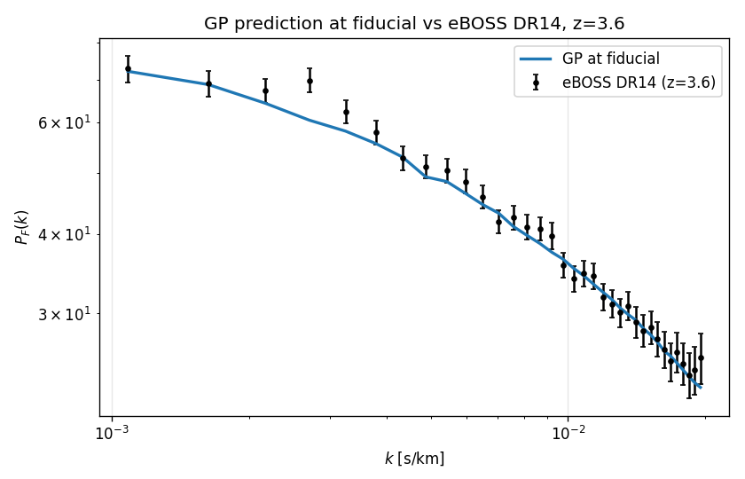
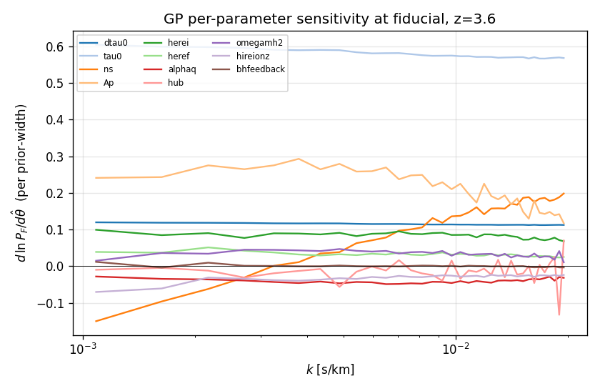
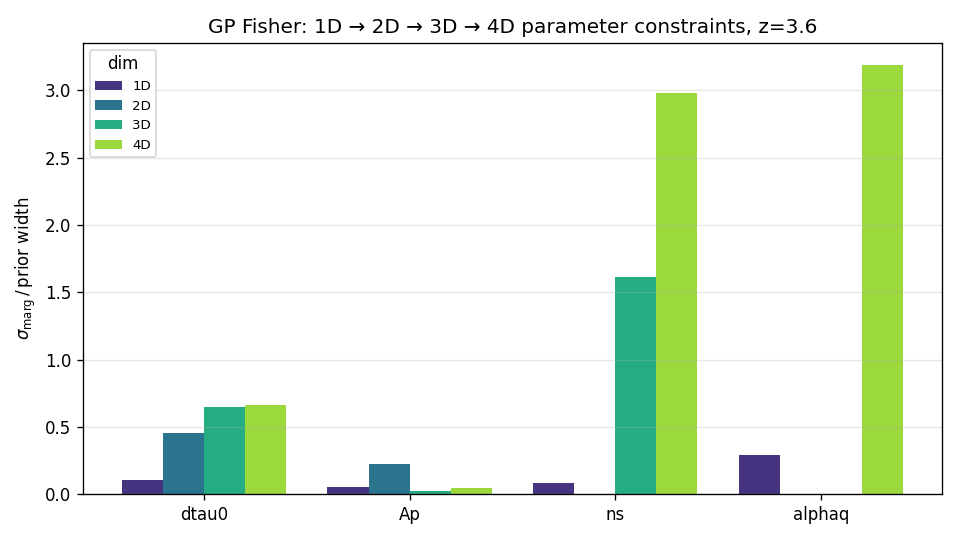

# Figures: what they show and what to check

Every forecast run produces these figures under its output directory. The
sample set under `docs/figures/` is regenerated by

    PYTHONPATH=/home/mfho/student_projects/lya_emulator_full:src \
        python scripts/regen_sample_figures.py

against the **real** PRIYA GP at fiducial + the eBOSS DR14 covariance.

Each figure below has a "diagnostic checklist" — what should be true if
the framework is working, and what's a red flag.

---

## fig01 — GP prediction at fiducial vs eBOSS DR14

**What it shows**: GP-emulated `P_F(k)` at the fiducial parameter values,
overlaid on the eBOSS DR14 measurement at `z=3.6` with ±σ error bars.

**Why it matters**: This is the single most important sanity check. The
forecast assumes the GP is the truth. If the GP isn't already a decent
fit to the data at fiducial, every forecast number downstream is
suspect. The student's PRIYA paper has already shown this fit works at
sub-percent level after MCMC; we just need to verify our pipeline is
loading the right z-bin, the right cov, and the right basedir.

**Checklist**:
- [ ] GP line tracks data points within ±σ across the entire k range.
- [ ] No discontinuities or sudden jumps in the GP curve.
- [ ] eBOSS error bars grow at low k (cosmic variance) — that's expected.

---

## fig02 — Per-parameter sensitivity

**What it shows**: For each of the 11 PRIYA parameters,
`d ln P_F / dθ̂_i` where `θ̂_i = θ_i / prior_width_i`. Curves with large
absolute values mean the data strongly responds to that parameter; flat-
near-zero curves mean the parameter is essentially invisible at this z.

**Why it matters**: Tells you which parameters are *worth* fitting PySR
equations for. Parameters with sensitivity ≪ 0.05 across the k-range
won't be constrained at any reasonable budget — don't bother training
PySR equations for them at one redshift, you need multi-z combination
to break the degeneracy.

**Sample reading**:
- `tau0` is dominant (~0.6) — mean flux is the largest single effect.
- `Ap` is second (~0.25) and constant in k — pure amplitude.
- `ns` flips sign through k≈0.005 — that's the spectral pivot.
- `dtau0/herei/heref/alphaq/hireionz/bhfeedback` cluster near zero.

**Checklist**:
- [ ] tau0 / Ap / ns visibly separate from the noise floor.
- [ ] At least one of (hub, omegamh2) shows non-trivial k-dependence.
- [ ] No spurious oscillations (a sign that the stencil step is too
      small and you're hitting numerical noise).

---

## fig03 — 1D → 4D Fisher progression

**What it shows**: σ_marg / prior_width per parameter, grouped by
forecast dimensionality (1D = only that param floats; 4D = all four
forecast params float jointly). The growth from 1D to 4D is the cost
of opening parameter degeneracies.

**Why it matters**: At 1D, σ is the lower bound — best you can do given
infinite prior knowledge of everything else. At 4D, σ inflates by the
ratio between joint and conditional sensitivity along the eigenvectors
of the full Fisher.

**Sample reading from the shipped figure (forecast subset = ns/Ap/hub/omegamh2)**:
- ns: small inflation (1D ≈ 4D).
- Ap, hub: modest inflation.
- omegamh2: 4D bar > 2 × prior width — **the prior alone gives a
  tighter constraint than this dataset can in the joint 4D forecast**.
  That's the hub-omegamh2 degeneracy (visible in the corner) saturating.

**Checklist**:
- [ ] Each 4D bar ≥ the corresponding 1D bar (degeneracies can only hurt).
- [ ] No NaN/inf bars (F is invertible across all dimensionalities).
- [ ] At least one 4D bar > 1 → that parameter needs multi-z data or
      external priors to break the degeneracy. Real result for the
      paper, not a bug.

---

## What to add when you have a PySR equation set

Run `scripts/train_and_forecast.py --equations <your.yaml>` (or
`--equations published` for the user-quoted equations); a fresh
`compare_loop/` directory is produced overlaying GP and PySR. Check:

- **fig01**: PySR and GP fiducial lines overlap within ±σ_eBOSS.
  Otherwise the equations aren't reproducing fid.
- **fig02**: PySR sensitivity tracks GP sensitivity for the parameters
  the equations actually depend on.
- **forecast_sigma**: PySR σ ≈ GP σ → equations preserve the GP's
  constraining power. PySR σ ≫ GP σ → tighten the Pareto pick (use
  `accuracy_at:` with a smaller tolerance) or retrain with bigger
  `maxsize` / `niterations`.
- **forecast_corner**: PySR ellipses overlap GP ellipses. Sharply
  different tilts → the PySR set is inducing a fake correlation, often
  because one parameter's equation is contaminating another's.

---

## The reward-loop comparison set (`docs/figures/compare_loop/`)

Whenever you run `compare_equation_sets()` (or
`scripts/regen_sample_figures.py` ships a sample), you get a directory
with these per-comparison artefacts:

### `eq_card_<set_name>.png` — equation card

A LaTeX-rendered listing of every equation in the set, with:
- The equation set's name, redshift, and combine recipe (rendered).
- Each per-parameter equation as `f_i(θ_i, k) = …`.
- Below each, the Pareto-pick metadata: complexity, loss, fiducial.

Use this to audit "what equations am I forecasting on?" at a glance.
If a particular parameter's equation looks too simple (constant, or
linear with tiny coefficient), that's why its 1σ blew up in
`forecast_sigma.png`.

### `forecast_sigma.png` — bar comparison

Log-y bar chart, one bar per (parameter, equation set) combination.
The GP is the reference; bars taller than GP mean that equation set is
losing information.

Sample reading from the shipped figures:
- `GP` and `perfect_1D_slices` bars are bit-for-bit identical → the
  comparison plumbing is correct (a perfect 1D-trained PySR set with
  multiplicative combine reproduces the GP Fisher exactly).
- `taylor_quadratic` is 2-3 orders of magnitude worse → that's what an
  under-trained equation set costs.

### `forecast_corner.png` — Fisher corner overlay

All equation sets overlaid; axes scaled to the *tightest* result so
the reference contours are always visible. If a PySR set's ellipse
runs off the panel as a straight line (as `taylor_quadratic` does in
the sample), the equations are too loose to constrain that subspace
at all — go retrain.

### `residual_<set_name>.png` — fiducial residual

`(P_PySR(θ_fid) - P_GP(θ_fid)) / σ_eBOSS` per k bin. If this is bigger
than ±1 anywhere, the equations don't even reproduce fid; everything
downstream is suspect.

### `summary.md` — scoreboard markdown

Plain markdown table of σ per parameter and σ_pysr/σ_gp ratio per
equation set. Drop into a slide or paper summary as-is.

### Iterating

This is your **reward loop**: each time you retrain PySR with new
hyperparameters / pick rules / combine choice, drop the new YAML in
`configs/eqns/`, rerun the comparison, and watch the bars + ellipses +
ratios shrink toward the GP reference. Once `taylor_quadratic`-style
1000× ratios drop to ~1.1× across all four parameters, your equations
are publishable.
