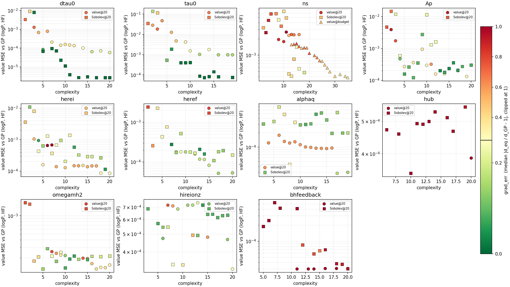
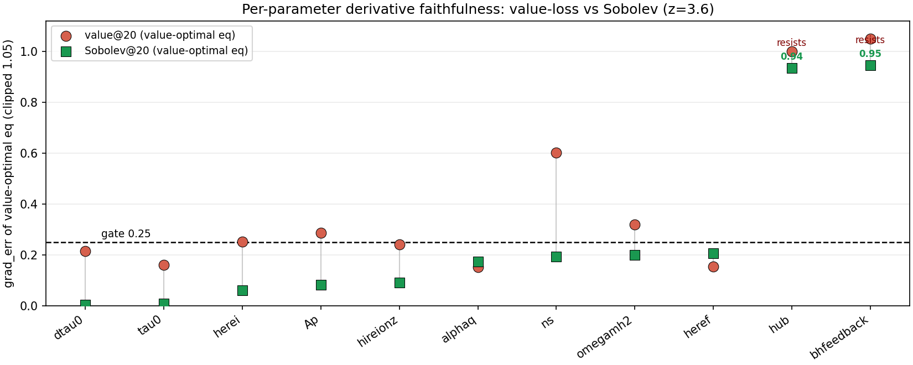
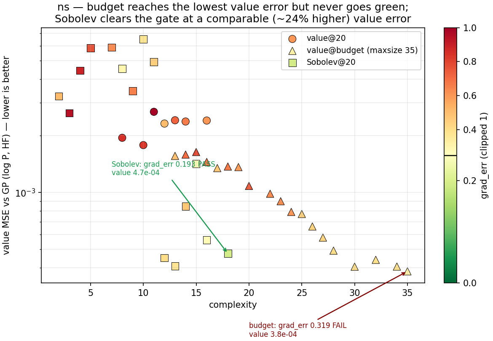
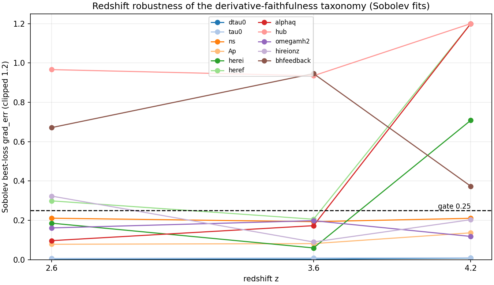

# Per-parameter Pareto-faithfulness — walkthrough

**Status:** color figure + per-parameter verdicts landed 2026-06-08 (single-z
z=3.6). Spec:
`docs/superpowers/specs/2026-06-08-pareto-faithfulness-diagnostic-design.md`.

## What this figure is, and why the paper turns on it

The paper is now a **diagnostic / failure-modes** contribution: *where, why, and
how badly per-parameter 1D symbolic regression (PySR) fails as a Fisher emulator
for the Lyman-α P1D, and what a Sobolev derivative-matching loss does and does
not fix.* This figure is the central instrument. It is modeled on the syren
Pareto-front plots (arXiv:2506.08783, Fig. A1) but adds the quantity the syren
family never reports: **derivative faithfulness** — whether an equation that
matches the GP's *values* also matches its *slopes* ∂P/∂θ, which is the only
thing a Fisher forecast actually uses.

**This redirect deliberately drops the σ_PySR/σ_GP forecast claim.** The 4-agent
review (2026-06-05) showed that σ_perfect_1D ≡ σ_GP is forced by construction
(the additive combine is anchored at P_GP(fid)), so the forecast "ladder" tests a
Jacobian, not an emulator, and the GP-slice fallback silently reports GP-derived
σ in the σ_PySR column. The derivative-faithfulness diagnostic below is what the
GP-as-oracle setup *can* legitimately support, and it is plotted with **no
GP-slice fallback** — a parameter with no faithful equation simply shows up
all-red.

## How to read the figure

- **One panel per parameter** (11 PRIYA parameters), single-z **z = 3.6**, on the
  real KODIAQ-SQUAD covariance.
- **x = complexity** (PySR equation node count); **y = `value_mse`** (log scale) =
  `mean over (θ,k) of (logP_eq − logP_GP)²` on the HF training θ-grid — a *common,
  cross-objective-comparable* value loss (see the axis note below). Each marker is
  one Fisher-safe Pareto candidate.
- **Series** (marker shape): `value@20` = circles (value-loss target, maxsize 20,
  stage6_log); `Sobolev@20` = squares (Sobolev derivative loss λ=5, stage9);
  `value@budget` = triangles (value-loss target at **certified maxsize≈35**,
  shown only on the ns panel — the budget control).
- **Marker color = `grad_err`** = `median_k |∂eq/∂θ ÷ ∂P_GP/∂θ − 1|` at the
  fiducial point over non-negligible k-bins — the *same metric the production
  derivative gate uses*. The colorbar is thresholded at the **0.25 gate** (black
  line): green ≤ 0.25 (derivative-faithful) → red ≫ 0.25 (the "Fisher's Mirage":
  right value, wrong slope). `grad_err` is clipped at 1 for color only; the
  sidecar keeps the raw value.

> **Metric space (was mislabeled — fixed 2026-06-08).** `grad_err` differences the
> **linear/raw P** prediction, `∂P_F/∂θ` — NOT `∂logP`: both `gp.predict` and
> `refit.predict` return raw `P_F`, so the gate is a ratio of linear-P slopes. This
> is the Fisher-consistent quantity (the paper's Fisher matrix uses `∂P_F/∂θ`
> against the linear-P KSData covariance), so the label is corrected to `∂P_F`
> everywhere; the numbers are unchanged. Note `value_mse` *is* in log-P space
> (`mean (logP_eq − logP_GP)²`) — that one is correctly labeled.

> **Why the y-axis is `value_mse`, not the PySR `Loss` column.** The PySR `Loss`
> is the *training objective*, which differs by run: for Sobolev it is
> `MSE + λ·‖∂eq − ∂GP‖²`, a numerically larger quantity than the value MSE. Plotting
> those raw losses together would make Sobolev look like it "fits values worse"
> purely by construction. So every candidate is re-scored against the GP with one
> common value metric (`value_mse`, the value analog of `grad_err`: same GP, same
> HF resolution). Now height (value) and color (derivative) are each comparable
> across all three series. `value_mse` is emulator-only, written to the sidecars
> next to `grad_err`; switch axes with `plot_pareto_faithfulness.py --y-col`.
>
> **The decoupling this exposes (ns).** value@budget reaches the *lowest* value_mse
> of any series (3.8×10⁻⁴; deeper search → better value fit) yet stays **red**
> (grad_err 0.32, never crossing the gate); Sobolev clears the gate (0.19) at a
> *comparable, slightly higher* value_mse (4.7×10⁻⁴, ~24% worse). So it is a paired
> comparison, not an equality: the deep value search reaches lower value error but
> never gets the slope right, while Sobolev gets the slope right at similar value
> error. Value accuracy and derivative faithfulness are independent axes — the
> Mirage, made literal.

### Two supplementary views

**Scorecard** — the one-glance summary (`grad_err` of the value-optimal equation,
value-loss ● vs Sobolev ■, sorted; gate dashed). Only hub & bhfeedback stay above
the gate under Sobolev; ns makes the biggest jump.

**ns money panel** — the budget control on the honest value axis: budget (▲) reaches
the lowest value_mse but never goes green; Sobolev (■) matches it and does.

## The mechanism the figure makes visible

PySR minimizes **value** mean-squared error. An equation can match P(θ) to high
accuracy yet have the wrong **slope** ∂P/∂θ at the fiducial point — and Fisher
sees only the slope. So *value-accurate ⇏ derivative-accurate*
(arXiv:2406.06067, "Fisher's Mirage"). In the figure this is a disagreement
between a marker's **height** (value loss, low = good) and its **color**
(derivative error, green = good): a low, red marker is the Mirage. The Sobolev
loss adds `λ·‖∂_θ eq − ∂_θ logP_GP‖²` to the objective, trading a little value
loss (squares sit *above* circles) to pull the slope onto the GP's — trading
height for color.

## The numbers (z = 3.6)

`grad_err` of the **value-optimal** equation (lowest loss) and of the **most
faithful** equation on each front; ✓/✗ = whether *any* equation on that front
clears the 0.25 gate. `x0@` = lowest complexity at which the parameter feature
enters under value@20.

| param | value: best-loss | value: best-faith | value ✓? | Sobolev: best-loss | Sobolev: best-faith | Sobolev ✓? | x0@ |
|-------|-----:|-----:|:--:|-----:|-----:|:--:|--:|
| dtau0 | 0.214 | 0.080 | ✓ | 0.003 | 0.003 | ✓ | 3 |
| tau0 | 0.160 | 0.159 | ✓ | 0.009 | 0.007 | ✓ | 1 |
| ns | 0.603 | 0.512 | ✗ | 0.193 | 0.193 | ✓ | 8 |
| Ap | 0.287 | 0.108 | ✓ | 0.082 | 0.036 | ✓ | 2 |
| herei | 0.251 | 0.068 | ✓ | 0.060 | 0.060 | ✓ | 3 |
| heref | 0.154 | 0.150 | ✓ | 0.206 | 0.039 | ✓ | 7 |
| alphaq | 0.152 | 0.152 | ✓ | 0.173 | 0.084 | ✓ | 4 |
| hub | 1.000 | 1.000 | ✗ | 0.935 | 0.935 | ✗ | 20 |
| omegamh2 | 0.320 | 0.138 | ✓ | 0.198 | 0.071 | ✓ | 7 |
| hireionz | 0.240 | 0.117 | ✓ | 0.090 | 0.066 | ✓ | 6 |
| bhfeedback | 1.715 | 1.334 | ✗ | 0.946 | 0.664 | ✗ | 11 |

### Budget control (ns) — the Mirage is not a search-budget artifact

The review's central objection was that "PySR can't" might really be "the search
was starved" (the ladder ran maxsize=20; `docs/PYSR_HYPOTHESIS.md` says curvature
needs maxsize≥30). We reran ns value-loss at **maxsize=35** and scored every
candidate (`results/decider_budget_z3.6/.../grad_faith_ns.csv`):

- best-loss (complexity 35, loss 0.442): `grad_err = 0.319` — **fails**.
- most faithful over the entire complexity 13→35 front: `0.319` — **fails**.
- **ANY passes the gate: no.**

Budget lowers value loss (0.44 at complexity 35) and improves the derivative
(0.512 → 0.319) but **plateaus above the gate**. Sobolev — a *smaller* budget,
targeted at the derivative — crosses it (0.193). So the ns Mirage is generative,
not a budget shortfall: you need the right *objective*, not more search.

## Per-parameter reading and the failure-mode taxonomy

Four categories emerge. The diagnosis for each is empirical (the table above)
plus the physical mechanism.

### 1. Robustly faithful — SR works out of the box
**dtau0, tau0, heref, alphaq, hireionz** (and Ap is borderline-robust). The
value-optimal equation already clears the gate; Sobolev makes them near-perfect
(dtau0 0.003, tau0 0.007). These are smooth, monotone, well-isolated P1D
responses (mean-flux and IGM-thermal amplitudes) whose ∂P/∂θ a low-complexity
expression captures directly.

### 2. Selection-sensitive Mirage — a faithful equation exists, but not the value-optimal one
**Ap, herei, omegamh2.** The lowest-loss equation fails the gate (Ap 0.287,
herei 0.251, omegamh2 0.320) but a faithful equation sits a little higher on the
*same value front* (best-faith 0.108 / 0.068 / 0.138). Here the failure is one of
**selection**: pick by value RMSE and you get the Mirage; pick by the derivative
gate (or train with Sobolev) and you recover it. This is the regime where the
gate-as-filter is sufficient — no new objective needed.

> Note on the herei × alphaq coupling: both are *individually* faithful here —
> their 1D marginal slopes ∂P/∂herei, ∂P/∂alphaq fit fine. The known +0.45
> coupling (`memory/headline_findings.md`) is an **off-diagonal / combine-level**
> limitation of the additive per-param construction, not a per-parameter gradient
> failure, so it does not show up in this single-parameter diagnostic.

### 3. Generative Mirage — only the Sobolev loss recovers it
**ns.** *No* equation on the value front is faithful, at maxsize 20 (best 0.512)
or at certified maxsize 35 (best 0.319). The Sobolev derivative loss generates a
faithful one (0.193, at complexity 18). ns is the P1D tilt around the pivot
scale: the value-optimal fit nails P's shape but systematically mis-estimates
∂P/∂ns, and only an objective that *targets the derivative* fixes it. This is the
clean, headline demonstration that the Sobolev loss is a genuine generative fix,
not a re-selection.

### 4. Resistant — unfaithful even with the Sobolev loss, at every complexity
**hub, bhfeedback.** These never clear the gate under *any* method.
- **hub** (Sobolev best 0.935): two compounding causes. (a) **Under-search /
  weak signal** — under value@20 the feature `x0` first enters only at complexity
  **20** (the max); across the rest of the front the equation does not contain hub
  at all (those candidates are dropped as not-Fisher-safe, carrying no derivative).
  (b) **Basis test — REFUTES the AP hypothesis (2026-06-09, `scripts/h_basis_test.py`).**
  We had guessed hub acts like a k-rescaling / Alcock–Paczynski-like distortion (a
  coordinate transform of k a native-k form can't express). The test says **no**:
  ∂P/∂h is only weakly correlated with the k-rescaling template ∂P/∂lnk
  (corr ≈ −0.25 at z=2.6/3.6/4.2; the template explains only ~6% of the variance).
  So hub's resistance is **a weak / under-determined response** (consistent with its
  stated ~1% P1D effect and x0 entering only at max complexity), **not** a clean
  basis/expressivity wall. Sobolev still plateaus at 0.935 because the signal is
  weak, not because the basis is wrong.
- **bhfeedback** (Sobolev best 0.664): **weak / near-degenerate gradient.**
  bhfeedback is effectively priored out; ∂P/∂bhfeedback is tiny and close to
  noise, so the target the gate/Sobolev tries to match is itself ill-conditioned.
  Value-loss grad_err is enormous (1.3–1.7); Sobolev improves it to 0.66 but
  cannot reach the gate.

## Taxonomy table

**Convention (fixed 2026-06-08):** all `grad_err` numbers below are the
**value-optimal (best-loss) equation** on each front — the same convention as the
scorecard. Where a more-faithful (best-faith) equation exists deeper on the front,
it is noted in parentheses. (Earlier this column mixed best-loss and best-faith,
which the referees flagged.)

| parameter | category | mechanism | value→Sobolev (best-loss `grad_err`) |
|-----------|----------|-----------|-------------------|
| dtau0 | robustly faithful | smooth isolated mean-flux response | 0.214 → 0.003 |
| tau0 | robustly faithful | smooth isolated mean-flux response | 0.160 → 0.009 |
| ns | **generative Mirage** | tilt about pivot; value fit mis-estimates ∂P/∂ns | **0.603 → 0.193** (budget@35: 0.319, still fails) |
| Ap | selection-sensitive | value-optimal unfaithful, faithful eq on front | 0.287 → 0.082 |
| herei | selection-sensitive | value-optimal unfaithful; coupling is combine-level | 0.251 → 0.060 |
| heref | robustly faithful | smooth IGM-thermal amplitude | 0.154 → 0.206 (already faithful on value; best-faith 0.039) |
| alphaq | robustly faithful | smooth IGM-thermal response | 0.152 → 0.173 (best-faith 0.084) |
| hub | **resistant** | weak/under-determined response (basis test refutes AP: corr −0.25, ~6% var) + under-search (x0@20) | 1.000 → 0.935 (no help) |
| omegamh2 | selection-sensitive | value-optimal unfaithful, faithful eq on front | 0.320 → 0.198 (best-faith 0.071) |
| hireionz | robustly faithful | smooth IGM-thermal response | 0.240 → 0.090 |
| bhfeedback | **resistant** | weak/degenerate gradient (priored out; gate can't adjudicate) | 1.715 → 0.946 (best-faith 0.664; fails) |

**Bottom line for the paper.** Per-parameter 1D SR is derivative-faithful for the
mean-flux and IGM-thermal amplitudes; three parameters (Ap, herei, omegamh2) need
a derivative-aware *selection* rule; ns needs the Sobolev *objective* (and the
budget control proves search depth alone is not enough); and **hub + bhfeedback
genuinely resist** — one for a basis/expressivity reason, one for a
weak-gradient reason. That is the honest failure-modes story, and every claim is
backed by a scored Pareto front in this figure.

## Redshift robustness (z = 2.6 / 3.6 / 4.2) — added 2026-06-08

Fresh value + Sobolev refits at z=2.6 and z=4.2 (properly retrained, not the z=3.6
equations re-used), each gate-evaluated. Runs:
`results/single_z_z{2.6,4.2}_{value,sobolev}/refit/z{2.6,4.2}/`. Figure:
`results/single_z_stage_pareto_diag/crossz_faithfulness.{png,pdf}`.

Sobolev best-loss `grad_err` by redshift:

| param | z=2.6 | z=3.6 | z=4.2 | verdict |
|---|---|---|---|---|
| dtau0 | 0.004 | 0.003 | 0.008 | stable pass |
| tau0 | 0.006 | 0.009 | 0.010 | stable pass |
| ns | 0.211 | 0.193 | 0.211 | stable pass |
| Ap | 0.079 | 0.082 | 0.137 | stable pass |
| omegamh2 | 0.162 | 0.198 | 0.118 | stable pass |
| herei | 0.186 | 0.060 | **0.709** | reshuffles → fails at z=4.2 |
| heref | **0.299** | 0.206 | **2.69** | reshuffles |
| alphaq | 0.097 | 0.173 | **1.56** | reshuffles → fails at z=4.2 |
| hireionz | **0.324** | 0.090 | 0.203 | borderline at z=2.6 |
| hub | 0.97 | 0.94 | 1.22 | stable fail (resistant) |
| bhfeedback | 0.67 | 0.95 | 0.37 | stable fail (resistant) |

**The taxonomy is NOT redshift-uniform.** Cosmology/mean-flux (dtau0, tau0, ns, Ap,
omegamh2) and the two resisters (hub, bhfeedback) are stable across z. The **He II
reionization block (herei, heref, alphaq) is faithful at z ≤ 3.6 and blows up at
z=4.2** — their P1D imprint is redshift-localised (strong near their reion epoch:
heref ends He II reion at z≈2.6–3.2, herei starts it at z≈3.5–4.1; near-noise away
from it), so at z=4.2 the GP slope is tiny and the gate **cannot adjudicate** (the
bhfeedback weak-gradient mechanism, switched on by redshift). Faithfulness tracks
the physics. Caveats: (i) the GP is least accurate at z=4.2 (~2% vs ~1% at z=3.6),
so part of the degradation is emulator-limited; (ii) IGM-thermal verdicts must be
stated per-redshift, and the multi-z Fisher (summed over 9 z-bins) is dominated by
the redshifts where each parameter is informative (≲3.6 for the He II block).

## Scope & reproducibility (read before quoting numbers)

- **Single-z, single-seed.** The taxonomy is at **z=3.6** (cross-z at 2.6/4.2 is a
  separate retrained check above). PySR is **stochastic**: the committed fronts are a
  **single seed** (production kwargs: maxsize 20, niter 50; budget control maxsize 35).
  A borderline number (e.g. ns 0.193 vs the 0.25 gate) is one draw — treat near-gate
  verdicts as indicative, not seed-robust, until an across-seed spread is reported.
- **"multi-z" is a branch-name artifact.** The headline is single-z; the multi-z
  joint-Sobolev "money plot" was **dropped** (it had a linear-P/log-P target mismatch,
  now guarded off in `refit_one_param_multi_z`). The multi-z gate code exists but no
  committed result exercises it.
- **What a bare clone can reproduce:** the four diagnostic figures + every taxonomy
  number, **emulator-free**, from the tracked `pareto_*.csv` + `grad_faith_*.csv`
  (`scripts/make_diagnostic_figs.py`). **What it cannot:** anything needing the GP —
  re-running the gate, regenerating sidecars, or the **h basis test** (GP-only; its
  result is committed at `results/h_basis_test/h_basis.json` so it stays verifiable).
- **GP-as-oracle caveat:** the diagnostic scores symbolic equations against the *GP*,
  treated as truth; it measures faithfulness *to the emulator*, not to the simulations.
