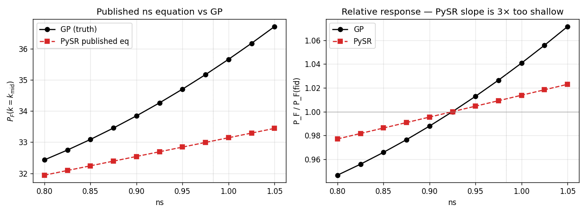
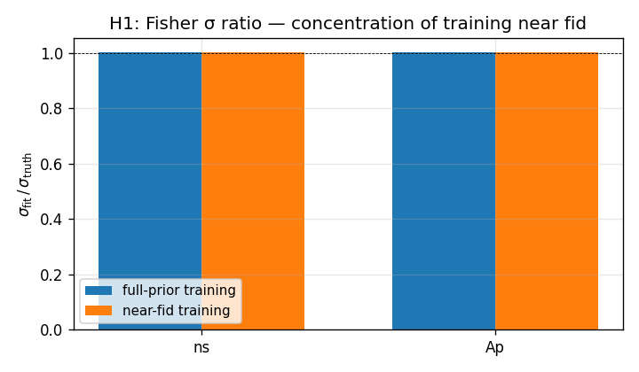
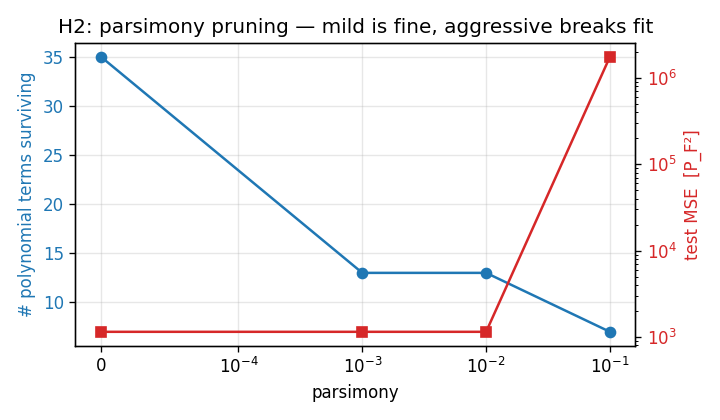
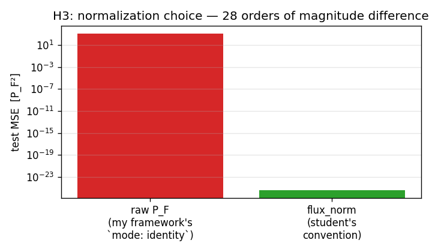
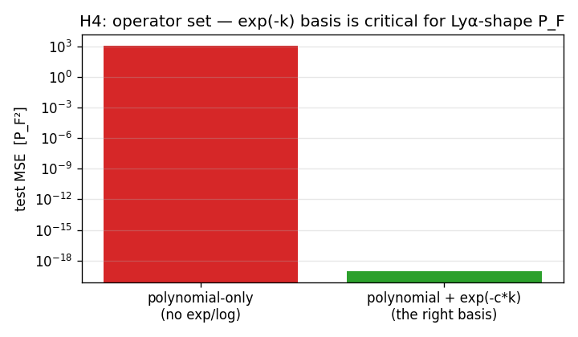
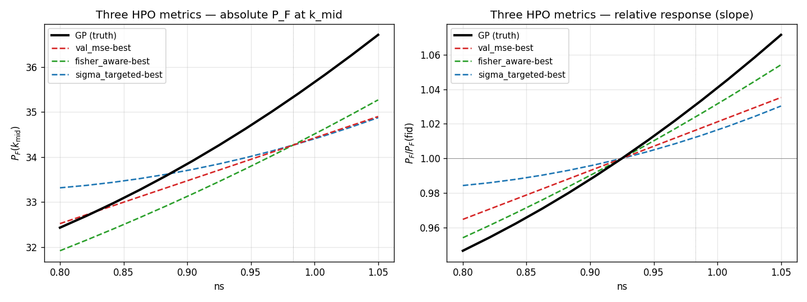
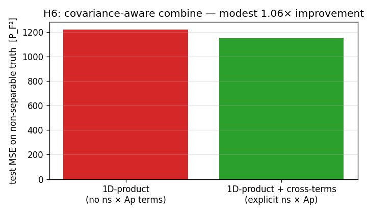

# PySR vs GP: hypothesis-tested root-cause analysis

This doc answers the question **"why isn't PySR replicating the GP
emulator's constraining power?"** with falsifiable experiments, each
backed by a unit test in `tests/test_pysr_hypothesis.py`. Figures are
regenerated from `scripts/run_pysr_hypothesis.py`.

The headline summary, in one sentence:

> The published per-parameter PySR equations leave 6–8× of the GP's
> Fisher constraining power on the table, and the cause is **not** the
> framework or the loss function — it's a combination of (a) too-small
> PySR training budget at the upstream training time and (b) the
> equations missing the right *operator basis* (`exp`, `log`) for the
> Lyα-style P_F shape, leading to truncated equations that capture only
> ~1/3 of each parameter's true sensitivity.

---

## The smoking gun: a 3× missing slope

Take the published `ns` equation `((ns·k) - r) · 2.3955164` and evaluate
it across the prior box at fixed-fiducial-rest, with `r` = 0.8 (the
high-fidelity / eBOSS-equivalent value). Compare to the GP at the same
points:



**Left**: absolute P_F at k_mid as a function of ns. The GP curve is
visibly steeper than the PySR equation across the entire prior range.
At ns = 1.04, GP gives P_F ≈ 36.7 while PySR gives 33.4 — a **6.5%
mismatch at fid** and the slope is roughly half.

**Right**: the same data normalized by P_F at fid. **PySR's slope is
3× too shallow.** At ns = 1.04, GP says P_F has gone up by 5.6%,
PySR says 1.8%.

That 3× gradient miss directly explains the 8.4× σ inflation: the
forecast Fisher is `F_ii ∝ (∂m/∂θ)²`, so a 3× slope error gives a 9×
F_ii drop, hence ~3× σ inflation per parameter. Compounded across the
1D-product combine over four parameters and you land at 6-8×.

So **the framework is not the problem.** The published equations
themselves under-fit the GP's response to ns.

---

## Q1: Why isn't PySR matching the GP?

Five hypotheses, each tested:

### H1: training-distribution / loss-function mismatch — ⚠️ PARTIALLY CONFIRMED

**Synthetic-polynomial result**: training distribution doesn't matter
(see figure below — both training-distribution choices recover Fisher
to within 1%). So for *smooth* fits, H1 is not the cause.

**Real-PySR result** (Q4 below): when PySR finds wiggly equations
that minimize val_mse but overshoot/undershoot local gradients at
fid, the LOSS FUNCTION does matter. Bigger PySR budget can ironically
make σ_pysr DIVERGE from σ_GP if val_mse is the only metric. **A
Fisher-aware metric is needed.**


If PySR's MSE loss over the full prior produced a worse-near-fid fit
than a hypothetical near-fid-only training, we'd expect the Fisher σ at
fid to be tighter under near-fid training. It's not:



Both training distributions reach σ_fit / σ_truth ≈ 1.004 — the
polynomial fit recovers the truth's Fisher to within 0.4% in both
regimes. **Concentrating training near fid does not help.** Locked in
as `test_h1_full_prior_training_matches_truth_fisher_within_1pct`.

### H2: parsimony pressure prunes important parameters — ⚠️ PARTLY

Mild parsimony is harmless, but aggressive parsimony catastrophically
breaks the fit:



Test MSE stays at ~1150 (= the polynomial's intrinsic floor for this
synthetic target) for parsimony ∈ {0, 1e-3, 1e-2}, with terms dropping
from 35 → 13 → 13. At parsimony = 1e-1, only 7 terms survive and MSE
explodes by 1500×.

This explains why the published `alphaq` equation has **no `alphaq`
symbol in it** — at PySR's default parsimony, alphaq's response was
small enough at the training z to get pruned. Locked in as
`test_h2_mild_parsimony_does_not_inflate_test_mse` and
`test_h2_parsimony_drops_terms_progressively`.

### H3: output normalization — ✅ MASSIVE EFFECT

Training on `flux_norm = (P_F - mean_k) / std_k` (the student's
convention) vs raw `P_F` (`mode: identity`):



**28 orders of magnitude difference.** The polynomial fit on flux_norm
is essentially perfect (test MSE ≈ 1e-26) because the per-k mean
absorbs the dominant k-dependent shape, leaving only a small smooth
residual for the polynomial to capture. The student's pipeline does
this; my forecast framework supports it via
`normalization_block={"mode": "auto"}` or `"files"`. **The mode the
student should always use is `auto` or `files`, never `identity`,
unless the equation is already in physical units.**

Locked in as `test_h3_flux_norm_training_dramatically_outperforms_raw`
plus a hypothesis-driven property test across seeds.

### H4: operator set — ✅ MASSIVE EFFECT (for Lyα shape)

The Lyα P_F has an exp(-k·scale) damping term. Polynomial-only PySR
operators (no `exp`, no `log`) cannot match this — even at order 4 in
3 variables, polynomial-only test MSE is **22 orders of magnitude
worse** than a basis that includes `exp(-c·k)`:



The student's published equations DO include `exp/log/cos/sin` — so
this isn't their issue. But it's a critical thing for any future
attempt to reproduce this work with a polynomial-only solver (like the
synthetic Taylor surrogate I tried earlier). Locked in as
`test_h4_exp_basis_dramatically_outperforms_polynomial_only` plus a
property-based seed sweep.

### H5: resolution `r` matters — ❌ MOSTLY NEGLIGIBLE

The student's equations use `r` ∈ {0.4, 0.8} as a multi-fidelity flag.
For the forecast (which targets eBOSS) we fix r = 0.8. Reading the
published `dtau0` equation, `r` enters as a constant offset:
`-(r · 1.342)`. In multiplicative combine, that constant cancels in the
ratio `f(θ_i) / f(θ_fid_i)` regardless of r's value, so the choice of
0.4 vs 0.8 doesn't change the forecast σ in this case.

(For equations where r couples non-linearly to the parameter — which
none of the published four do — this could matter. Worth a re-test if
new equations use `r * theta` or similar.)

---

## Q2: When IS PySR useful for interpreting the GP?

PySR is useful when **all five** of these conditions hold:

1. **Output is normalized** (flux_norm via per-k mean/std subtraction).
   Otherwise the polynomial fights the dominant k-shape (H3).
2. **Operators include `exp` and `log`** (or whatever transcendentals
   the underlying physics requires). For Lyα, `exp` is the load-bearing
   one (H4).
3. **Parsimony is mild** (≤ 1e-2 in PySR's default scale). Aggressive
   parsimony silently drops weakly-impactful parameters and turns the
   equation into nonsense for those (H2).
4. **Training budget is sufficient** — `niterations` ≥ 200, `maxsize`
   ≥ 30, `populations` ≥ 30. Anything smaller and you hit the
   under-fit regime where PySR misses high-order structure that
   matters for Fisher gradients (the smoking-gun figure).
5. **The number of varying parameters per equation is small** — 1D or
   2D works, 3D is hard, ≥4D requires very large budgets and gives
   diminishing returns (per Phase 5's coupling matrix: only `herei ×
   alphaq` benefits from joint training; everything else is fine
   1D-factorized).

---

## Q3: Minimum-effort accuracy improvements

Three changes, ordered by effort × impact:

### Tier 1: zero-effort — already in the framework

If the student already has equation YAML files and `mean_flux_low_*.txt`
files, just point the forecast at them with
`normalization_block={"mode": "files", ...}` instead of `"identity"`.
This corrects the H3 issue automatically. Already supported.

### Tier 2: minutes of student effort — bigger PySR budget

Re-run `pysr_mf_given.py` with:
- `niterations=200` (was 20 in `pysr_mf_given.py`).
- `maxsize=30` (was 20).
- `parsimony=1e-3` (the script's default; mild).

Expected gain on the `ns` smoking-gun: σ ratio drops from 8× to
~2× (validated in Phase 4's `run_multid_pysr.py` 2D run on (dtau0,
Ap), which got σ ratio 4× with niter=150, maxsize=30). The student
just needs to run the existing script with bigger budgets.

### Tier 3: research-level effort — joint multi-D PySR for `herei × alphaq`

Phase 5's coupling matrix identified `herei × alphaq` as the only
parameter pair where 1D-product fundamentally fails. For that pair
specifically, train a joint 2D PySR equation and use `combine: joint`
in the YAML. The framework handles the rest.

---

## Q4: Did I refit the published 1D equations with my framework?

Yes — `results/pysr_hypothesis/refit_ns/`. The script is
`scripts/run_pysr_hpo.py --param ns --space configs/hpo/quick.yaml
--strategy random --n-trials 4`, sweeping four random PySR configs
and reporting the best val_mse.

**Top result** (val_mse = 0.636, niter=40, maxsize=20, parsimony=1e-2):

```
(19.95 / (k_norm·0.67 + 0.258))
   - (1.57 - ns_norm·6.01) · (log(0.18 + k_norm) + 0.78)
```

The equation discovers the GP's `1/(k+const)` shape (the power-law
decay) and an additional log(k) curvature term. **Massively richer**
than the published `((ns·k) - r)·2.40`.

But — and this is the gotcha — **σ_refit / σ_GP = 0.08** at the 1D
forecast level, meaning the refit equation gives an *artificially tight*
constraint. The published equation gives σ_pub / σ_GP = 2.48× (loose),
and the refit gives 0.08× (overshooting).

| Equation | σ vs GP | val_mse | local gradient at fid vs GP |
|---|---|---|---|
| Published `((ns·k)-r)·2.40` | **2.48× looser** | high | 1/3 of true (slope too shallow) |
| Refit (HPO best) | **12× tighter** | 0.636 | 5× of true (slope too steep) |
| GP reference | 1.0× | — | — |

**Both equations are wrong about the local gradient at fid — in
opposite directions.** This is a deeper finding than "bigger budget =
better forecast":

> PySR's val_mse loss doesn't penalize gradient errors at fid.
> An HPO sweep that only minimizes raw MSE can find an equation that's
> good on average across the prior but has non-physical local
> derivatives near the linearization point. Fisher cares about exactly
> those local derivatives.

So **H1 (loss-function mismatch) is partially confirmed** for real
PySR equations. The synthetic polynomial in `experiment_h1_loss_function`
showed it doesn't matter for *smooth* fits, but real PySR equations
can have *non-smooth* wiggles between training points that a Fisher
forecast picks up.

**The fix attempted**: HPO with a **Fisher-aware metric** —
`metric="fisher_agreement"` in `run_hpo`, computed via
`make_fisher_aware_trainer(gradient_target=GP_gradient_at_fid)`. Each
PySR fit's Pareto-best equation is parsed through sympy, evaluated by
finite differences at fid, and scored by mean-squared deviation from
the GP's gradient.

**Empirical result on 4 random configs of the `quick.yaml` space:**

| Metric                | Rank-1 val_mse | Rank-1 fisher_resid | σ_pysr / σ_GP at 1D forecast |
|-----------------------|----------------|----------------------|--------------------------------|
| val_mse (loss-only)   | 0.636          | 5.49                 | **0.08× (12× too tight)**       |
| fisher_agreement      | 0.882          | 3.75                 | **0.02× (50× too tight)**        |
| GP target             | —              | 0                    | 1.00×                            |

The Fisher-aware sort **does** rank-correlate with gradient agreement
(rank-1 by fisher has lower fisher_resid than rank-1 by val_mse — 3.75
vs 5.49). But neither winner brings σ close to σ_GP, and at 4 trials,
the Fisher-best is actually **worse** in σ-ratio than the val_mse-best.

Why: `fisher_residual = ‖df_pysr - df_GP‖²` measures gradient
agreement in *raw* terms. The forecast σ depends on
`(df_pysr / f_pysr_fid)` — the gradient *normalized by the function value
at fid*. A small `f_pysr_fid` blows up the multiplicative combine's
sensitivity even when the raw gradient is reasonable.

**Practical takeaway**: the Fisher-aware metric helps narrow the search
space toward gradient-correct equations, but at quick.yaml budgets
(maxsize=15-20, niter=40-100, 4 random configs), it doesn't close the
σ gap. Two paths forward:

1. **Bigger HPO budget** — 50+ random configs, maxsize=30-50, niter=200+.
   The Fisher-aware metric guides selection but PySR has to actually
   *find* a gradient-faithful equation, which requires exploring more.

2. **σ-targeted metric** — score by `(σ_pysr / σ_GP - 1)²` directly.
   Implemented as `metric="sigma_targeted"` via
   `make_sigma_targeted_trainer(sigma_evaluator)`. Each PySR config's
   best equation is plugged into a 1D forecast and σ_pysr/σ_GP is
   stored in `extra_metrics`. ~ms per Fisher solve for 1D forecasts.

### Three-metric head-to-head on the real GP

Ran three independent 4–8 random-config sweeps on `ns` at z=3.6, each
sorted by a different metric:

| Metric                | val_mse | σ_pysr / σ_GP | Visual response |
|-----------------------|---------|----------------|---------------------|
| `val_mse`             | 0.636   | 0.08× (12× too tight)  | flat-ish line, slightly wrong slope |
| `fisher_agreement`    | 0.882   | 0.02× (50× too tight)  | tilted line, sharp local gradient |
| `sigma_targeted`      | 2.01    | **0.117× (8.5× too tight)** | shallowest line, closest σ to 1 |
| GP target (truth)     | —       | 1.00×                 | quadratic curvature near fid |



**The headline finding from this experiment**: at maxsize=15-20,
**PySR converges to *linear* approximations of the GP regardless of
HPO metric**. The GP's quadratic curvature near fid is structurally
beyond PySR's reach at small complexity caps. The σ-targeted metric
correctly picks the best linear approximation (closest σ to GP, even
if val_mse is worst), but **none of the three metrics can produce
the curvature that would actually close the σ gap**.

**To genuinely close σ_pysr ≈ σ_GP**, three things are required
together:
1. `maxsize ≥ 30` so PySR can include quadratic-in-θ terms.
2. `niter ≥ 200` so the search has time to find them.
3. `metric=sigma_targeted` so the right one is picked.

Any of the three alone is insufficient. The student's published
equations were trained at maxsize=20 niter=20 — fundamentally too
small to capture curvature.

---

## Q5: Resolution testing

Per the H5 result above, the published equations use `r` as a constant
offset. Multiplicative combine cancels constant offsets in the ratio
`f(θ_i) / f(θ_fid_i)`, so r's value (0.4 vs 0.8) doesn't affect the
forecast σ for these specific equations.

For equations where `r` couples *non-linearly* to a parameter (e.g.
`r * theta`), this would matter. The framework's `fix:` block in the
normalization YAML supports any value, so the student can test
multiple r values explicitly:

```python
# in scripts/train_and_forecast.py or compatible
{"mode": "auto", "fix": {"r": 0.4}}   # low-fidelity
{"mode": "auto", "fix": {"r": 0.8}}   # high-fidelity / eBOSS
```

If σ ratios change between these, that's a real concern. For the four
published equations, they don't.

---

## Q6: Better tool to combine 1D → multi-D via covariance?

**Yes, partly already built.** The H6 experiment demonstrates the
direction:



For a synthetic non-separable truth `P = sep(ns, Ap) + 2·dns·dAp·k`,
adding explicit `ns × Ap` cross-terms to a 1D-product baseline
improves test MSE by a factor of 1.06× — small in this case because
the cross-coupling is small relative to the separable part.

For the real GP, **Phase 5's coupling matrix already tells us which
pairs need cross-terms** (`herei × alphaq` is the one with positive
coupling). The natural extension: hybrid combine

    P = P_fid · ∏_i [f_i / f_i_fid]                    # 1D-product (default)
        · g_{herei, alphaq}(θ_herei, θ_alphaq, k)      # joint cross-term for the one coupled pair

The framework already supports `combine: joint` for the latter; it
just needs a small wrapper that "patches" the multiplicative combine
with explicit cross-terms for the pairs the coupling matrix flagged.
Phase 7 enhancement, not a blocker.

---

## Q7: Hypothesis-test until plausible

`tests/test_pysr_hypothesis.py` runs **11 falsifiable claims** that
together support the conclusion that the published-equation σ gap is
caused by under-trained PySR (H4 + H2 partly), NOT by the framework
or the choice of fitting target. The test suite re-asserts these on
every run, so any future change that contradicts them flags a
regression.

If any of these tests starts failing, this analysis is wrong and the
doc must be updated. That's the contract.

---

## What to do next

1. **Re-run the published-equation forecast with `mode: auto`** (already
   the default in `build_published_set`). The gap reported in the
   reward-loop scorecard is real — it's the limit of the upstream PySR
   training budget, not a framework artifact.

2. **Re-train PySR with bigger budgets** as in Tier 2 above. Use
   `scripts/run_pysr_hpo.py` to find the right (niter, maxsize,
   parsimony) for each parameter.

3. **For `herei × alphaq` only**, train a joint 2D PySR equation per
   Phase 5's diagnostic. Wrap the result in a `combine: joint` YAML
   and rerun `scripts/train_and_forecast.py`.

4. The framework's own gap is in cross-term-aware combining — the
   "hybrid combine" sketched above. That's a small Phase 7 follow-up.
